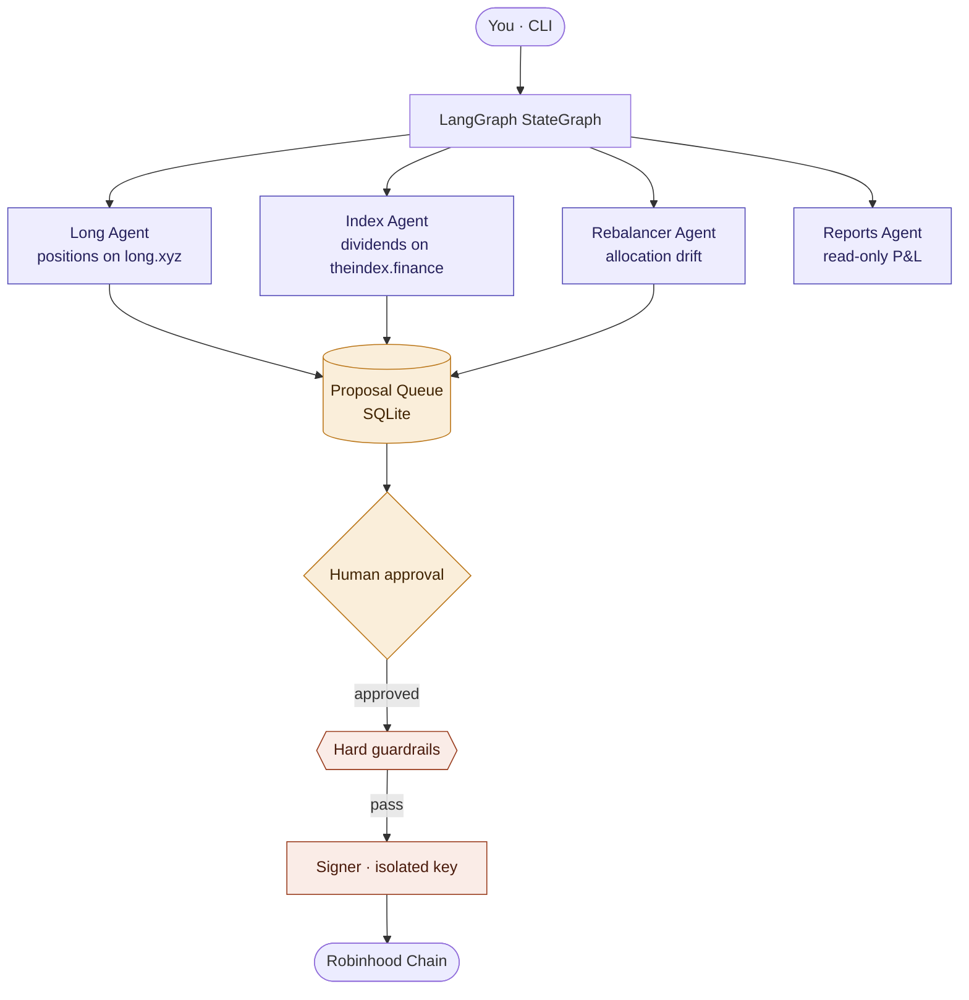

<div align="center">

<pre>
    ____                          _    ____
   / __ \____  ____  ____ _____  / \  /  _/
  / /_/ / __ \/ __ \/ __ `/ __ \/ _ \ / /
 / ____/ /_/ / / / / /_/ / /_/ / ___// /
/_/    \____/_/ /_/\__, /\____/\/  /___/
                  /____/
</pre>

**A LangGraph multi-agent orchestrator for managing on-chain assets on Robinhood Chain.**

Monitors positions on [long.xyz](https://app.long.xyz/), tracks dividend streams on [theindex.finance](https://theindex.finance/), and coordinates rebalancing — with human-in-the-loop approval for every transaction.

[](https://www.python.org/)
[](https://langchain-ai.github.io/langgraph/)
[](https://web3py.readthedocs.io/)
[](https://robinhood.com/us/en/chain/)
[](#license)
[](#roadmap--status)

[Architecture](#architecture) · [Stack](#stack) · [Install](#project-installation) · [Usage](#cli-usage) · [Security](#security)

</div>

---

## Overview

Agents propose. You approve. A separate executor signs.

The orchestrator runs four specialist agents wired together as a LangGraph `StateGraph`. Each agent is a ReAct loop with its own tools, and each is a node in the graph — order is explicit, state is captured by the checkpointer, and every step is inspectable. Agents read on-chain state, apply a policy you define in YAML, and enqueue concrete transaction proposals into a local SQLite queue. Nothing reaches the chain without your explicit approval — and even then, transactions pass through a set of hard guardrails enforced outside any LLM context.

> **Note** — This is a scaffold. The LangGraph wiring, proposal queue, executor, guardrails, and CLI are functional end-to-end. The tool implementations that read specific contract state are stubs pending real ABIs. See [Roadmap](#roadmap--status).

## Table of contents

<table>
<tr>
<td valign="top" width="33%">

**Getting started**
- [Architecture](#architecture)
- [Stack](#stack)
- [Prerequisites](#prerequisites)
- [Installation](#project-installation)

</td>
<td valign="top" width="33%">

**Using it**
- [Configuration](#configuration)
- [CLI usage](#cli-usage)
- [End-to-end flow](#end-to-end-flow)
- [Tests](#tests)

</td>
<td valign="top" width="33%">

**Operations**
- [Security](#security)
- [Roadmap / status](#roadmap--status)
- [Contributing](#contributing)
- [License](#license)

</td>
</tr>
</table>

---

## Architecture



**Design principles**

<table>
<tr>
<td width="50%" valign="top">

**Isolated signing**<br/>
Agents never see the private key. Only the executor has access — ideally through a Safe, KMS, or hardware wallet, not a plaintext env var.

</td>
<td width="50%" valign="top">

**Simulate before approval**<br/>
Every proposal runs through `eth_call` against a recent block. The expected diff is visible when you approve, so surprises stay in testing.

</td>
</tr>
<tr>
<td width="50%" valign="top">

**Guardrails outside the LLM**<br/>
Max notional per tx, contract whitelist, slippage cap, gas ceiling, daily tx count. Enforced in `executor/guardrails.py` regardless of what the agent produces.

</td>
<td width="50%" valign="top">

**Read-only is read-only**<br/>
The Reports agent has no access to `submit_proposal`. Its capability set makes it structurally incapable of moving funds.

</td>
</tr>
</table>

---

## Stack

<table>
<thead>
<tr><th>Layer</th><th>Technology</th><th>Why</th></tr>
</thead>
<tbody>
<tr><td>Language</td><td><a href="https://www.python.org/"><b>Python 3.11+</b></a></td><td>Mature ecosystem for Web3 and agent frameworks</td></tr>
<tr><td>Agents</td><td><a href="https://langchain-ai.github.io/langgraph/"><b>LangGraph</b></a> · <a href="https://python.langchain.com/"><b>LangChain Core</b></a></td><td>Explicit StateGraph, ReAct loops, checkpoints, replayable steps</td></tr>
<tr><td>LLM</td><td>Anthropic Claude · OpenAI GPT</td><td>Via <code>langchain-anthropic</code> / <code>langchain-openai</code>; configurable via <code>LLM_MODEL</code></td></tr>
<tr><td>Blockchain</td><td><a href="https://web3py.readthedocs.io/"><b>web3.py 7.x</b></a> · <b>eth-account</b></td><td>Standard EVM client, compatible with Robinhood Chain (Arbitrum L2)</td></tr>
<tr><td>CLI</td><td><a href="https://click.palletsprojects.com/"><b>Click</b></a> · <a href="https://rich.readthedocs.io/"><b>Rich</b></a></td><td>Declarative commands, colored and tabular output</td></tr>
<tr><td>Persistence</td><td><a href="https://sqlmodel.tiangolo.com/"><b>SQLModel</b></a> (SQLite)</td><td>Proposal queue and local audit log</td></tr>
<tr><td>Config</td><td><b>Pydantic v2</b> · <b>PyYAML</b> · <b>python-dotenv</b></td><td>Strong validation, YAML config, secrets in <code>.env</code></td></tr>
<tr><td>Scheduling</td><td><a href="https://apscheduler.readthedocs.io/"><b>APScheduler</b></a></td><td>Daemon mode for periodic scans</td></tr>
<tr><td>HTTP</td><td><b>httpx</b></td><td>External APIs (Safe Tx Service, oracles)</td></tr>
<tr><td>Tests</td><td><b>pytest</b></td><td>Smoke tests for the queue and guardrails</td></tr>
<tr><td>Quality</td><td><b>ruff</b> · <b>mypy</b></td><td>Optional lint and type-check</td></tr>
</tbody>
</table>

---

## Prerequisites

Every OS needs the same trio: **Python 3.11+**, **Git**, **pip**. Pick your platform below.

<details>
<summary><b>Linux</b> — Ubuntu · Debian · Fedora · Arch</summary>

**Ubuntu / Debian**
```bash
sudo apt update
sudo apt install -y python3.11 python3.11-venv python3-pip git build-essential
```

**Fedora**
```bash
sudo dnf install -y python3.11 python3-pip git gcc
```

**Arch**
```bash
sudo pacman -S python python-pip git base-devel
```

**Verify**
```bash
python3.11 --version   # Python 3.11.x or higher
git --version
```

</details>

<details>
<summary><b>macOS</b> — Intel · Apple Silicon</summary>

Requires [Homebrew](https://brew.sh/). If you don't have it yet:
```bash
/bin/bash -c "$(curl -fsSL https://raw.githubusercontent.com/Homebrew/install/HEAD/install.sh)"
```

Install:
```bash
brew install python@3.11 git
```

Verify:
```bash
python3.11 --version
git --version
```

On Apple Silicon (M1/M2/M3), everything runs native on ARM — no Rosetta required.

</details>

<details>
<summary><b>Windows 10 / 11</b> — WSL2 (recommended) · Native</summary>

Two paths. WSL2 is strongly recommended for the Web3 stack.

**Option A — WSL2 (recommended)**

1. Open PowerShell as Administrator:
   ```powershell
   wsl --install -d Ubuntu
   ```
2. Reboot when prompted.
3. In the Ubuntu terminal that launches, follow the **Linux** section above.

**Option B — Native Windows**

1. Install Python 3.11+ from [python.org/downloads](https://www.python.org/downloads/). During install, **check "Add Python to PATH"**.
2. Install [Git for Windows](https://git-scm.com/download/win).
3. Install [Microsoft C++ Build Tools](https://visualstudio.microsoft.com/visual-cpp-build-tools/) — some dependencies compile native code.
4. Verify in PowerShell:
   ```powershell
   python --version
   git --version
   ```

> **Tip** — If PowerShell blocks venv activation later, run once:
> `Set-ExecutionPolicy -Scope CurrentUser -ExecutionPolicy RemoteSigned`

</details>

---

## Project installation

<details open>
<summary><b>Linux · macOS · WSL</b></summary>

```bash
git clone https://github.com/PongoAII/PongoAI.git
cd PongoAI
python3.11 -m venv .venv
source .venv/bin/activate
pip install --upgrade pip
pip install -e .
```

</details>

<details>
<summary><b>Windows PowerShell</b></summary>

```powershell
git clone https://github.com/PongoAII/PongoAI.git
cd PongoAI
python -m venv .venv
.\.venv\Scripts\Activate.ps1
pip install --upgrade pip
pip install -e .
```

</details>

Verify the CLI:

```console
$ pongo --help
Usage: pongo [OPTIONS] COMMAND [ARGS]...

  PongoAI — multi-agent manager for long.xyz & theindex.finance.

Commands:
  execute    Send all approved proposals through guardrails + signer.
  proposals  Inspect and approve/reject proposals.
  report     Read-only reports.
  scan       Run one full scan pass: all agents look, propose, enqueue.
  watch      Daemon mode: scan on a schedule.
```

For development (tests + lint):

```bash
pip install -e ".[dev]"
```

---

## Configuration

Three files to fill in: `.env` (secrets), `config/policy.yaml` (strategy), `config/contracts.yaml` (addresses).

### 1. Environment variables

```bash
cp .env.example .env       # Linux / macOS / WSL
```
```powershell
Copy-Item .env.example .env   # Windows
```

Minimum viable `.env`:

| Variable | Purpose | Example |
|---|---|---|
| `ANTHROPIC_API_KEY` *or* `OPENAI_API_KEY` | LLM provider credential | `sk-ant-...` |
| `LLM_MODEL` | Model the agents use | `claude-opus-4-7` |
| `RPC_URL` | Chain endpoint | `https://testnet.rpc.chain.robinhood.com` |
| `CHAIN_ID` | From block explorer | `...` |
| `SIGNER_MODE` | `local` · `safe` · `kms` | `local` |
| `PRIVATE_KEY` | **Testnet only** | `0x...` |

> **Warning** — For company treasury on mainnet, use `SIGNER_MODE=safe` with a Gnosis Safe. Never store a mainnet private key in a plaintext env file.

### 2. Policy — `config/policy.yaml`

Defines target allocation, thresholds, and hard guardrails.

| Field | Meaning |
|---|---|
| `allocation.target` | Desired split (%) between long.xyz and theindex.finance |
| `allocation.rebalance_threshold_pct` | Minimum drift before the Rebalancer proposes a swap |
| `long_xyz.watch` | Tokens to monitor (symbols match `contracts.yaml`) |
| `long_xyz.max_position_usd` | Cap per individual position |
| `theindex_finance.claim_min_usd` | Minimum accrued value to trigger a claim proposal |
| `theindex_finance.claim_gas_multiplier` | Skip claim if gas > accrued / N |
| `guardrails.*` | Hard limits enforced by executor (notional, slippage, gas, tx/day, whitelist) |

### 3. Contracts — `config/contracts.yaml`

> **Important** — This file ships with `null` addresses on purpose. long.xyz and theindex.finance are new (Robinhood Chain mainnet launched July 1, 2026); populate these from official sources rather than trusting anything hardcoded here.

Sources to check:

- Docs and pinned tweets from `@long_xyz` and `@TheIndexFi`
- The Robinhood Chain block explorer once contracts are verified
- Each project's official documentation site

ABIs live in `abis/*.json` — download from the block explorer's verified contract page.

---

## CLI usage

<table>
<tr>
<th align="left" width="30%">Command</th>
<th align="left">What it does</th>
</tr>
<tr>
<td><code>pongo scan</code></td>
<td>Run one pass of all agents. Reads on-chain state, enqueues proposals. <b>No transactions sent.</b></td>
</tr>
<tr>
<td><code>pongo proposals list</code></td>
<td>List pending proposals. Add <code>--all</code> to include approved/rejected/executed/failed.</td>
</tr>
<tr>
<td><code>pongo proposals show &lt;id&gt;</code></td>
<td>Full JSON of a proposal — calldata, rationale, simulation result, notional.</td>
</tr>
<tr>
<td><code>pongo proposals approve &lt;id&gt;</code></td>
<td>Mark a proposal ready for execution. Add <code>--by "name"</code> for audit trail.</td>
</tr>
<tr>
<td><code>pongo proposals reject &lt;id&gt; --reason "..."</code></td>
<td>Reject with a required reason.</td>
</tr>
<tr>
<td><code>pongo execute</code></td>
<td>For each approved proposal: re-check guardrails, prompt for final confirmation, sign, send.</td>
</tr>
<tr>
<td><code>pongo execute --yes-all</code></td>
<td>Skip interactive confirmation. <b>Testnet automation only.</b></td>
</tr>
<tr>
<td><code>pongo report pnl [--since DATE]</code></td>
<td>P&amp;L report. Defaults to last 30 days.</td>
</tr>
<tr>
<td><code>pongo watch --interval 15m</code></td>
<td>Daemon mode. Runs <code>scan</code> on a schedule (accepts <code>s</code>/<code>m</code>/<code>h</code> suffixes). Approval still required.</td>
</tr>
</table>

---

## End-to-end flow

From zero to first signed transaction on testnet:

```
 ┌────┐    ┌────────┐    ┌────────┐    ┌─────────┐    ┌─────────┐    ┌────────┐    ┌────────┐
 │ 1  │ →  │   2    │ →  │   3    │ →  │    4    │ →  │    5    │ →  │   6    │ →  │   7    │
 └────┘    └────────┘    └────────┘    └─────────┘    └─────────┘    └────────┘    └────────┘
 Install   Testnet RPC   Fund from    Fill contracts   Tune policy  pongo scan   pongo execute
                          faucet          .yaml           .yaml
```

<details>
<summary><b>Step-by-step</b></summary>

1. **Install** the project (see [Installation](#project-installation)).
2. **Set testnet RPC** in `.env`: `https://testnet.rpc.chain.robinhood.com`.
3. **Fund** your test wallet from `faucet.testnet.chain.robinhood.com`.
4. **Fill `contracts.yaml`** with testnet addresses of the contracts you want to interact with.
5. **Tune `policy.yaml`** — start with a small target allocation and tight guardrails.
6. Run `pongo scan` — watch proposals appear in `pongo proposals list`.
7. `pongo proposals show <id>` — inspect calldata, simulation, notional.
8. `pongo proposals approve <id>` — approve one.
9. `pongo execute` — confirm the prompt; keep the returned tx hash.
10. Verify on the block explorer that the tx was mined.
11. `pongo report pnl` — see the result.

Only after this cycle passes cleanly on testnet, migrate to mainnet: swap RPC, swap chain_id, set `SIGNER_MODE=safe`, and point at your treasury Safe.

</details>

---

## Tests

```bash
pip install -e ".[dev]"
pytest
```

The test suite covers the proposal queue (enqueue, list, approve) and the guardrails (rejection of non-whitelisted contracts, notional above limit). No RPC required — mocks stand in for chain access.

Lint and type-check:

```bash
ruff check .
mypy src
```

---

## Security

> **Warning** — Read this section before running against mainnet.

- **Never commit `.env`.** `.gitignore` covers it, but confirm `git status` shows only `.env.example` before your first commit.
- **Testnet first.** The full flow must pass cleanly on testnet before touching mainnet.
- **Use a Safe for company funds.** Setting `SIGNER_MODE=safe` changes the model entirely: instead of signing directly, the app proposes transactions that require N-of-M signatures from Safe owners. Sensible default for treasury: **2-of-3**.
- **Guardrails are a floor, not a ceiling.** LLMs can hallucinate. Always review calldata and simulation output at approval time.
- **The key never leaves the signer.** No agent code reads `PRIVATE_KEY`. If a lint check ever shows an agent module importing it, treat that as a critical bug.
- **The contract whitelist is intentional.** Each new entry is a new attack surface. Adding one should be a deliberate decision, not an incidental fix.
- **Local rate limiting.** `guardrails.daily_tx_limit` protects against a runaway proposal loop.

---

## Roadmap / status

**Working today**

- [x] LangGraph `StateGraph` wiring four specialist ReAct agents
- [x] SQLite proposal queue with full lifecycle (enqueue → approve → execute)
- [x] Hard guardrails (whitelist, notional, slippage, gas, daily count)
- [x] Local signer + Safe mode skeleton
- [x] Full CLI (`scan`, `proposals`, `execute`, `report`, `watch`)
- [x] Smoke tests for queue and guardrails

**Stubs pending real implementation**

- [ ] `src/tools/long_tools.py` — read positions, encode swaps on long.xyz
- [ ] `src/tools/index_tools.py` — read dividends, encode claims on theindex.finance
- [ ] `src/tools/portfolio.py` — aggregate snapshot and historical P&L
- [ ] `src/executor/signer.py` — Safe Transaction Service integration, KMS mode
- [ ] Historical snapshot persistence for accurate P&L over time

**Suggested build order**

1. `index_tools.get_accrued_dividends` — read-only, simplest
2. `portfolio_snapshot` — depends on (1) and equivalent long.xyz reads
3. `long_tools.get_position_snapshot`
4. Calldata encoders for swaps and claims
5. Safe mode of the signer, then mainnet migration

---

## Contributing

Contributions welcome. Please open an issue before large changes so we can align on approach. For code changes:

1. Fork and create a feature branch.
2. `pip install -e ".[dev]"` and make sure `pytest`, `ruff check`, and `mypy src` all pass.
3. Add a test for anything security-relevant (guardrails, queue transitions).
4. Open a PR with a clear description of what changed and why.

---

## License

Released under the [MIT License](LICENSE).
